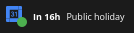
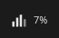
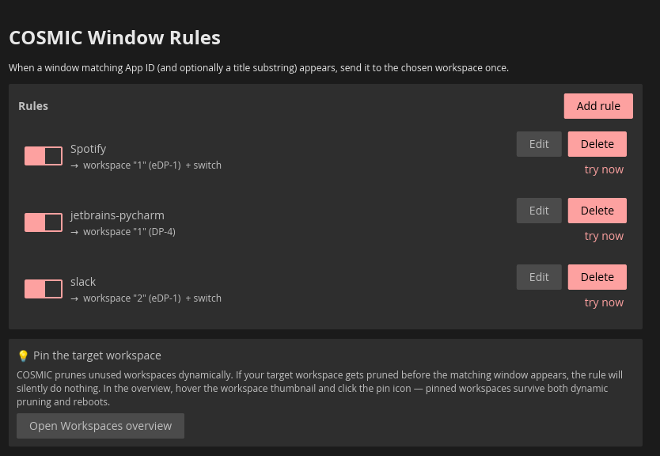

# cosmic-applet for productivity (google+taxi+slack+quotabar)

> **Disclaimer:** all of these applets are vibe-coded. They work on the
> author's machine; expect rough edges, audit anything that touches
> credentials before relying on it, and treat the code as a starting
> point rather than production-grade software.

A bundle of COSMIC desktop panel applets — two that surface bits of your Google
account, one that tracks time and exports to a [taxi](https://github.com/sephii/taxi)
timesheet, one that mirrors the Slack tray-icon unread count by reading
its DBus tooltip, one that surfaces your OpenAI + Anthropic AI API
usage, and one that assigns windows to workspaces by App ID, in the panel:

| Applet | Binary | What it shows | Icon |
|---|---|---|---|
| [Gmail Unread](#gmail-applet) | `cosmic-applet-gmail` | Number of unread Gmail messages, refreshed periodically. ||
| [Next meeting](#google-agenda-applet) | `cosmic-applet-google-agenda` | Next Google Calendar event with a live countdown, plus a desktop notification a few minutes before it starts. ||
| [Taxi tracker](#taxi-tracker-applet) | `cosmic-applet-taxi` | Multi-timer time tracking with daily auto-export to `taxi` (e.g. Liip's Zebra). ||
| [Slack Unread](#slack-applet) | `cosmic-applet-slack` | Badge mirroring Slack's tray-icon ToolTip — pulled over DBus, no Slack API, no token. ||
| [AI Quota Bar](#quotabar-applet) | `cosmic-applet-quotabar` | OpenAI + Anthropic API token usage (5h / weekly) read from local OAuth sessions. Port of the Swift [`mr-chatter`](https://github.com/Jonathanm10/mr-chatter) project, MIT-licensed. ||
| [Window Rules](#windowrules-applet) | `cosmic-applet-windowrules` | Assigns windows to a chosen workspace by `app_id` on first appearance — COSMIC counterpart of KDE's KWin Window Rules. ||

The two Google-backed applets follow the same model:

- **Left-click** the panel item → opens a useful URL (Gmail inbox / next
  event's Meet link, falling back to <https://calendar.google.com>).
- **Right-click** → menu with **Credentials**. Selecting it spawns the same
  binary with `--show-settings`, which runs as a regular Wayland toplevel
  window (not a panel popup) so it survives focus changes — including
  switching to a password manager to paste the secret.
- Settings (email, OAuth client ID, intervals, toggles) live in cosmic-config.
- Secrets (OAuth client secret, refresh token, access token) live in the
  freedesktop Secret Service (e.g. gnome-keyring under COSMIC).
- They share an OAuth + keyring helper crate ([`cosmic-google-common`](cosmic-google-common/)),
  so adding more Google-backed applets later only requires implementing the
  applet-specific UI and API call.

`cosmic-applet-taxi` is unrelated to Google — it tracks local time and
pushes merged + rounded sessions to your `~/zebra/%Y/%m.tks` timesheet
via the `taxi` CLI (invoked through `uv run`).

`cosmic-applet-slack` is also unrelated to Google — it queries the
session bus for Slack's `StatusNotifierItem` and parses the unread count
out of the tooltip text. No OAuth, no Slack API, no token; it just
mirrors whatever Slack already publishes to the desktop's tray protocol.

`cosmic-applet-quotabar` is a Rust / libcosmic port of
[`mr-chatter`](https://github.com/Jonathanm10/mr-chatter) (the project
formerly known as `QuotaBar`). It reads the OAuth sessions that
[Claude Code](https://claude.com/claude-code) and
[Codex](https://github.com/openai/codex) already keep on disk and hits
each provider's usage endpoint, so there's nothing to configure — if
you've logged into either CLI, the panel just shows your remaining
5-hour and weekly quotas. MIT-licensed to match upstream.

## Build & install

Requires Rust 1.85+ (for `edition = "2024"`), `just`, and a working Wayland
session. On Pop!_OS / COSMIC the Secret Service backend is gnome-keyring;
it must be running for either applet to remember credentials.

```sh
just release             # release build + user install into ~/.local for every applet,
                         # then restart cosmic-panel so it picks up the new binaries
                         # (use `sudo just install-system` after this for /usr)
```

`just release` lays each applet's binary, desktop entry, and icon into:

- `~/.local/bin/<crate>`
- `~/.local/share/applications/<AppId>.desktop`
- `~/.local/share/icons/hicolor/scalable/apps/<AppId>.svg`

…for every crate listed in [`Cargo.toml`](Cargo.toml)'s `[workspace]
members` (the AppIds follow the pattern `com.github.ragusa87.CosmicApplet<CamelCaseName>`).

> ⚠️ `~/.local/bin` must be on your `$PATH` — the panel runs the binary by
> name (`Exec=cosmic-applet-gmail` etc.) and resolves it via `PATH`. Most
> distros add it automatically; check with
> `echo $PATH | tr ':' '\n' | grep .local/bin`.

If you only want one applet:

```sh
just release cosmic-applet-gmail         # or any other workspace crate
```

For tight dev-loop iteration on a single applet (same install + panel
restart, but with the `release-fast` profile for quicker compiles):

```sh
just dev cosmic-applet-gmail
```

### Add an applet to the panel

A COSMIC panel applet is **not** a standalone program — `just run cosmic-applet-gmail`
(or running the binary directly) will not produce a panel icon, because
applets are spawned by the COSMIC panel as Wayland sub-surfaces. Once
installed:

1. **Settings → Desktop → Panel** (or right-click the panel → *Configure*).
2. Scroll to **Applets** → **Add Applet**.
3. Pick **Gmail Unread**, **Next meeting**, **Taxi tracker**,
   **Slack Unread**, and/or **AI Quota Bar** from the list and drag it
   into Left, Center, or Right.

If the entry does not appear in the Add-Applet list, the panel has cached
its applet index. Force a re-scan with one of:

```sh
pkill cosmic-panel        # the session manager respawns it within ~1s
# or: log out and back in
```

Then proceed to the [one-time Google Cloud setup](#one-time-google-cloud-setup)
below, and right-click the new panel icon → **Credentials** to authorize.

### Uninstall

```sh
just uninstall-user       # or `sudo just uninstall-system` for /usr
```

Removes the binary, desktop entry, and icon for **every** applet.

## One-time Google Cloud setup

Each applet uses a **bring-your-own-credentials** model: instead of shipping
a shared OAuth client (which would be capped at 100 unverified users), each
user creates their own Google Cloud OAuth client. Roughly 5 minutes once
per applet (the two applets can share a Google Cloud project but each needs
its own scope and client ID).

1. Open <https://console.cloud.google.com/> and create a new project (any
   name) — or reuse an existing one.
2. **APIs & Services → Library** → enable the API you need:
   - For Gmail Unread: **Gmail API**.
   - For Next meeting: **Google Calendar API**.
3. **APIs & Services → OAuth consent screen**:
   - User type: **External**.
   - App name: anything (e.g. "My COSMIC Google Bundle"), support email: your own.
   - **Scopes** → add the scope your applet needs:
     - Gmail Unread: `https://www.googleapis.com/auth/gmail.metadata`
     - Next meeting: `https://www.googleapis.com/auth/calendar.events.readonly`
   - **Test users** → add your own Google account.
   - Leave the app in **Testing** mode (don't submit for verification —
     you're the only user).
4. **APIs & Services → Credentials → Create credentials → OAuth client ID**:
   - Application type: **Desktop app**.
   - Name: anything.
   - Click **Create**. Copy the **Client ID** and **Client secret**.
5. Right-click the applet in the panel → **Credentials**. The applet
   spawns itself with `--show-settings`, which opens a standalone window
   with the form. It's a real toplevel window so clicking other apps (e.g.
   a password manager) won't dismiss it. Close it with one of:
   - **Authorize with Google** — runs the OAuth flow (opens a browser tab
     to Google's consent screen; granting access redirects to a "you can
     close this tab" page) and exits the settings window once the refresh
     token is stored.
   - **Cancel** — exits without saving.
   - The window manager's ✕ button — same as Cancel.

   The panel applet picks up the new credentials automatically: when
   settings writes to cosmic-config, the applet's config watcher fires and
   triggers a reload of the tokens from Secret Service.

You can also launch the settings window directly without going through the
panel:

```sh
cosmic-applet-gmail --show-settings
cosmic-applet-google-agenda --show-settings
```

## Forcing a refresh

Each applet polls on its own cadence. To trigger an immediate refresh:

```sh
pkill -USR2 -f cosmic-applet-gmail            # poll Gmail right now
pkill -USR2 -f cosmic-applet-google-agenda    # refetch calendar right now
pkill -USR2 -f cosmic-applet-taxi             # reload taxi state right now
pkill -USR2 -f cosmic-applet-slack            # re-read Slack tooltip right now
pkill -USR2 -f cosmic-applet-quotabar         # refetch AI quotas right now
```

Or, to signal every applet at once:

```sh
just refresh
```

On receiving SIGUSR2, the Google applets reload the OAuth tokens from
Secret Service and fetch right away; the taxi applet reloads its state
file and re-detects `uv`; the Slack applet wakes the DBus discovery loop
and re-reads the StatusNotifierItem tooltip; the QuotaBar applet
re-reads the local Claude / Codex OAuth files and refetches both
providers' usage. The settings windows (running under the same binary
names) ignore SIGUSR2, so sending the signal to all processes with that
name is safe — only the panel applet acts on it.

### Pre-filling credentials from the environment

For local development, the client ID and secret are read from environment
variables when the form field is empty:

```sh
# Gmail applet
export GMAIL_APPLET_CLIENT_ID=...apps.googleusercontent.com
export GMAIL_APPLET_CLIENT_SECRET=GOCSPX-...

# Agenda applet
export AGENDA_PANEL_CLIENT_ID=...apps.googleusercontent.com
export AGENDA_PANEL_CLIENT_SECRET=GOCSPX-...
```

A persisted value (from a previous **Authorize** click) always wins over
the environment.

## Gmail applet

Reads the unread count via the Gmail API's
[`users.labels.get`](https://developers.google.com/gmail/api/reference/rest/v1/users.labels/get)
endpoint on `INBOX` (the `messagesUnread` field) once per poll interval.

**Configuration** — non-secret settings live in
`~/.config/com.github.ragusa87.CosmicAppletGmail/v1/`:

| Key                  | Default | Notes                                |
|----------------------|---------|--------------------------------------|
| `email`              | `""`    | Filled when you click **Authorize**. |
| `client_id`          | `""`    | Same — written from the settings form. |
| `poll_interval_secs` | `60`    | Clamped to a minimum of 15s.         |

You can edit `poll_interval_secs` by hand; the applet picks up changes live.

Secrets are stored under Secret Service entry
`com.github.ragusa87.CosmicAppletGmail:tokens / {email}` as a JSON blob
containing `client_secret`, `refresh_token`, `access_token`, and
`expires_at_unix`.

**Scope rationale** — `gmail.metadata` is the minimum scope that exposes
label counts. The applet calls `users/me/labels/INBOX` once per poll and
reads the `messagesUnread` field — it never reads message bodies, subjects,
or sender addresses.

## Google Agenda applet

Shows the next event on your primary Google Calendar with a live countdown,
and fires a desktop notification a few minutes before it starts. The
countdown (`12m`, `1h`, `now`) updates **every 30s locally** from a cached
event list — the Calendar API is only hit every 5 minutes.

**What gets filtered out** — the applet ignores:

- **Cancelled** events.
- **All-day** events (no precise start time).
- Events you marked as **Free** (Calendar's `transparency=transparent`).
- Events where **you** declined the invite.

**Debugging what the panel sees** — if the panel isn't showing the event
you expect (or *is* showing one you don't), run with `--debug`. It uses
the stored credentials, hits the Calendar API once, and prints every
fetched event to stdout together with the verdict (`KEEP` or
`SKIP — <reason>`):

```sh
cosmic-applet-google-agenda --debug
```

The bottom of the report shows the configured intervals, which event would
be displayed next, and when a notification would fire. No GUI, no panel
required.

**Configuration** — non-secret settings live in
`~/.config/com.github.ragusa87.CosmicAppletGoogleAgenda/v1/`:

| Key                       | Default | Notes                                              |
|---------------------------|---------|----------------------------------------------------|
| `email`                   | `""`    | Filled when you click **Authorize**.               |
| `client_id`               | `""`    | Same — written from the settings form.             |
| `fetch_interval_secs`     | `300`   | Calendar API poll cadence. Clamped to min 60s.     |
| `display_tick_secs`       | `30`    | Local countdown refresh. Clamped to min 5s.        |
| `notification_lead_secs`  | `300`   | Notify this many seconds before start. `0` disables. |
| `show_title`              | `true`  | Show event title next to the countdown.            |

You can edit these by hand; the applet picks up changes live.

Secrets are stored under Secret Service entry
`com.github.ragusa87.CosmicAppletGoogleAgenda / {email}` as a JSON blob
containing `client_secret`, `refresh_token`, `access_token`, and
`expires_at_unix`.

**Scope rationale** — `calendar.events.readonly` is the minimum scope that
exposes event titles, times, and conference data. The applet calls
`calendars/primary/events` once per fetch interval — it never modifies
events, never sees attendee details beyond your own RSVP status, and never
touches other calendars.

## Taxi tracker applet

A multi-timer time tracker that auto-exports merged + rounded sessions to
your [taxi](https://github.com/sephii/taxi) timesheet. Designed for the
"start a timer, switch tickets, forget to stop it before lunch, panic at
the end of the day" workflow.

**What it does:**

- One panel button. Left-click opens a popup with one row per timer
  (alias + description + live elapsed + ▶/⏸ button).
- Each timer carries an `alias` (taxi-native, autocompleted from your
  `taxirc` + `taxi alias list`) and a per-session description. Editing
  the description on a running session updates the timer's default so
  the next start pre-fills with it.
- **One timer at a time** — clicking ▶ on a paused row pauses whatever
  was running first. No overlapping ranges to clean up.
- While running, the panel button shows
  `[⏱ _hello: TICKET-1 Setup 01:23 · 04:32]`.
- **fixme: Auto-pause on screen lock / suspend** via DBus
  (`org.freedesktop.ScreenSaver`, `org.freedesktop.login1`).
- **Daily auto-export (Untested)** at a configurable cut-over hour (default `04:00`):
  for each closed session whose work-date is in the past, merge gaps
  under 5 min, round each merged span to ≥ 15 min, append the lines to
  `~/zebra/%Y/%m.tks`, and drop them from local state.
- **Manual Export…** dialog for an arbitrary date — preview the merged
  lines, then confirm to append.
- **Auto-derived timer list**: on startup the applet scans the current
  and previous month's `.tks` and seeds a row per distinct alias used,
  pre-filled with the most recent description. Deleting a row
  suppresses that alias from future auto-derivation.

**Requirements:**

The applet *runs* fine without anything but COSMIC + a Wayland session.
**Taxi features** (alias refresh, export, auto-export) need
[`uv`](https://docs.astral.sh/uv/) on `$PATH`. The applet calls taxi as
`uv run --with taxi,taxi-zebra taxi <args>` (configurable). If `uv` is
not installed, taxi features are hidden from the UI and a small
"Install `uv` to enable taxi export" caption shows in the popup; the
timer functionality still works.

Your existing `~/.config/taxi/taxirc` is read directly for the path
template (`[taxi].file`, default `~/zebra/%Y/%m.tks`), date format
(`[taxi].date_format`), and alias sections (`[default_aliases]`,
`[<backend>_aliases]`).

**Configuration** — non-secret settings live in
`~/.config/com.github.ragusa87.CosmicAppletTaxi/v1/`:

| Key                   | Default                                     | Notes                                          |
|-----------------------|---------------------------------------------|------------------------------------------------|
| `cutover_hour`        | `4`                                         | Anything before this hour is the previous day. |
| `merge_gap_minutes`   | `5`                                         | Pause/resume gaps under this collapse to one entry. |
| `round_min_minutes`   | `15`                                        | Each merged span rounded up to at least this.  |
| `taxi_command`        | `uv run --with taxi,taxi-zebra taxi`        | Whitespace-split, args appended.               |
| `taxirc_path`         | `""`                                        | Blank → resolve `~/.config/taxi/taxirc`.       |

State (timer list + sessions) lives in
`~/.local/state/cosmic-applet-taxi/state.json`. Aliases cached by
`taxi alias list` live alongside it.

Open the settings or export window directly:

```sh
cosmic-applet-taxi --show-settings
cosmic-applet-taxi --show-export
```

## Slack applet

Mirrors Slack's own tray-icon unread state. **No Slack API, no token, no
OAuth** — Slack already publishes a `StatusNotifierItem` on your session
bus with a tooltip like `"You have 3 notifications"`; the applet reads
that tooltip and renders the badge.

**Discovery** — Slack registers three sibling connections on the bus
(typically `:1.854`, `:1.855`, `:1.856`); only one of them serves
`/StatusNotifierItem`. The applet:

1. Enumerates session-bus names.
2. Filters to connections whose `/proc/<pid>/comm` is `slack`.
3. Among those, picks the one whose `/StatusNotifierItem` exposes a
   readable `ToolTip` property (with a 500 ms timeout per probe so a
   flaky sibling can't stall the panel).
4. Subscribes to that item's `NewToolTip` signal for instant updates
   and watches `NameOwnerChanged` on the bus to detect Slack
   quitting/restarting. A 2 s rescan when Slack is down and a 5 s
   safety re-read while running cover the cases where the signal
   path stays silent.

**Badge states** — the tooltip text is parsed into three possible states:

| Tooltip text                 | Badge                       |
|------------------------------|-----------------------------|
| `You have 3 notifications`   | `3`                         |
| `You have unread messages`   | `•` (dot — count unknown)   |
| `No unread messages`         | (hidden)                    |
| Slack not running            | (hidden, applet icon only)  |

Parsing: first `\d+` match in `title + " " + description` wins (if > 0).
Otherwise a case-insensitive substring check: `"no unread"` /
`"no notification"` → no badge; `"unread"` / `"notification"` → dot
indicator; nothing else matches → no badge.

**Interactions:**

- **Left-click** runs `xdg-open slack:` (Slack registers this URL
  scheme handler on install — typically focuses the existing window).
- **Right-click** opens a one-item menu with **Refresh** (same effect
  as `pkill -USR2 -f cosmic-applet-slack`).

**Debugging what the panel sees** — run with `--debug` to print the
full fetch pipeline once and exit:

```sh
cosmic-applet-slack --debug
```

Output walks each Slack-owned bus name, shows whether `/StatusNotifierItem`
is reachable, prints the raw `ToolTip` tuple (`icon_name`, `icon_count`,
`title`, `description`), the step-by-step parse (digit match, then
keyword fallbacks), and which connection would be chosen. Useful when
Slack changes its tooltip wording in an update — you can see the exact
string and adjust the parser.

For continuous live logging, run the panel applet with
`RUST_LOG=cosmic_applet_slack=debug`: every fetch emits a `tracing`
event with the title, description, and parsed `Unread` variant.

**Configuration** — none. The applet hardcodes the `slack` process
name. If you need to support a different process name (Snap, Flatpak,
forks), edit `SLACK_PROCESS` in `cosmic-applet-slack/src/slack.rs`.

**Requirements** — Slack desktop ≥ recent enough to register a tray
icon via `org.kde.StatusNotifierItem` (standard for years). Wayland +
COSMIC panel as usual. Nothing else.

## QuotaBar applet

`cosmic-applet-quotabar` is a Rust / libcosmic port of the Swift
[`mr-chatter`](https://github.com/Jonathanm10/mr-chatter) project
(formerly `QuotaBar`) by Jonathan M. It shows your remaining
**OpenAI** + **Anthropic** API quotas in the COSMIC panel by reading
the local OAuth sessions that the Claude Code and Codex CLIs already
maintain — **no extra credentials, no API keys, no Google Cloud
setup**.

This crate is **MIT-licensed** to match the upstream project; see
[`cosmic-applet-quotabar/LICENSE`](cosmic-applet-quotabar/LICENSE).
The rest of the workspace stays GPL-3.0-or-later.

**What you see** — the panel button shows the worst-used percentage
across both providers (e.g. `8%`). Left-click opens a popup with a
horizontal bar per provider × window (Daily = 5h, Weekly = 7d),
color-graded from green (low) through orange to red (≥ 90%). Right-click
gives a one-item **Refresh** menu.

**How auth works** — there is no OAuth flow inside the applet:

- **Anthropic** — reads `~/.claude/.credentials.json` (the file
  Claude Code writes after `claude login`), refreshes the token via
  `platform.claude.com/v1/oauth/token` when it's expired, then calls
  `api.anthropic.com/api/oauth/usage` to fetch the 5h / 7d
  utilization. Refreshed tokens are written back to the same file
  atomically.
- **OpenAI** — reads `~/.codex/auth.json` (the file the Codex CLI
  writes after `codex login`), refreshes via
  `auth.openai.com/oauth/token` when needed, then calls
  `chatgpt.com/backend-api/wham/usage` for the primary / secondary
  rate-limit windows. API-key-only auth modes
  (`OPENAI_API_KEY` in `auth.json`) are intentionally rejected — the
  ChatGPT usage endpoint requires an OAuth session.

If either local credential file is missing the applet keeps working
with the other provider; the missing one shows an inline warning in
the popup.

**Refresh cadence** — every **5 minutes** automatically, plus on
demand via the popup's Refresh button, the right-click menu, or
`pkill -USR2 -f cosmic-applet-quotabar`.

**Configuration** — none. Both endpoints, the OAuth client IDs, and
the credential file paths are hardcoded to match what Claude Code and
Codex use today.

**Debugging what the panel sees** — print one snapshot per provider
and exit:

```sh
cosmic-applet-quotabar --debug
```

The output dumps the parsed `ProviderSnapshot` (used percent, reset
timestamp) for each provider, or the underlying error string when a
fetch fails (missing credentials, expired refresh token, HTTP error,
etc.).

**Requirements** — `~/.claude/.credentials.json` from a logged-in
Claude Code install, and/or `~/.codex/auth.json` from a logged-in
Codex install. Both files are produced by `claude login` / `codex
login` respectively; the applet never invokes those flows itself.

## Window Rules applet

`cosmic-applet-windowrules` is the COSMIC counterpart of KDE Plasma's
**KWin Window Rules**, intentionally scoped down to the 80% case: *"when a
window matching this App ID appears, send it to that workspace."*
No OAuth, no API keys, no daemon — it just listens for new toplevels
over `ext-foreign-toplevel-list-v1` and acts on them via
`zcosmic_toplevel_manager_v1::move_to_ext_workspace`.

**What you see** — the panel button shows a workspace-grid icon.
**Left-click** opens a status popup (enabled / total rules, last rule
fired). **Right-click** opens a one-item menu with **Settings…**,
which spawns the standalone rule editor as a regular Wayland toplevel
(survives focus changes).

**The rule editor** ([screenshot](cosmic-applet-windowrules/windowrules-settings.png)):



It lets you:

- **Pick a target window from a dropdown** of currently-open toplevels
  — clicking one autofills the App ID, so you don't need to memorise
  `org.mozilla.firefox` vs `Firefox` vs `firefox`. The list is a live
  Wayland-side enumeration, not a guess.
- Optionally filter by a case-insensitive **title substring**
  (e.g. `Private` to send Firefox private windows to a different
  workspace from regular ones).
- Pick the **target workspace** from a dropdown, which shows every
  workspace COSMIC currently exposes with its monitor name and a
  `(pinned)` tag where applicable. Workspaces are output-disambiguated:
  if you have a `"1"` on `eDP-1` and another `"1"` on `DP-4`, the rule
  remembers which one you picked.
- Toggle **"Switch to the chosen workspace"** if you want the rule to
  also focus the destination after moving the window. Off by default.
- Each saved rule has **Edit / Disable / Delete** buttons, plus a
  **try now** link that scans the currently-open toplevels and applies
  the rule to any matching window on demand (so existing windows don't
  have to be reopened to pick up a freshly-added rule). The result —
  "Moved N window(s) to workspace …" or "No matching windows." — shows
  under the row for a few seconds and then fades. The
  rule-uniqueness check rejects two rules with the same
  `(app_id, title_filter)` tuple — handy for catching "I created two
  Spotify rules going to different workspaces" mistakes.

**Pin your target workspaces** — COSMIC prunes unused workspaces
dynamically (only the ones in active use plus one trailing extra
exist at any moment). If your rule targets workspace `5` but
workspace `5` was pruned before the matching window appears, the move
silently does nothing. The editor includes an in-dialog tip and an
**Open Workspaces overview** button; in the overview, hover the
target's thumbnail and click the pin icon. Pinned workspaces survive
both dynamic pruning and reboots.

**Rule storage** — `cosmic-config` under `com.github.ragusa87.CosmicAppletWindowRules` (no
secrets). The panel applet reloads the config from disk every time it
sees a new toplevel, so edits in the settings window apply
immediately without a restart.

**Debugging what the panel sees** — stream every Wayland subscription
event to stdout:

```sh
cosmic-applet-windowrules --debug
```

This prints capabilities, the workspace list (with `[pinned]` tags),
the open toplevels (with their `app_id` and `title`), and every
`new_toplevel` event as it fires. Useful when figuring out what
`app_id` to put in a rule, or verifying that a workspace really is
pinned.

**Caveat** — cosmic-comp 1.0.x implements
`move_to_ext_workspace` (the v4 toplevel-management request) but
omits it from its hardcoded capability list. The applet detects this
and attempts the request anyway with a one-time warning. Future
cosmic-comp releases will likely advertise it correctly and the
warning will go away on its own.

**Requirements** — a recent COSMIC desktop (cosmic-comp ≥ 1.0
exposing `ext-workspace-v1` + the v4 toplevel-management protocol).
Nothing else.

## Troubleshooting

- **Gmail panel shows `—` forever** → the applet has no credentials;
  right-click → Credentials to authorize.
- **Gmail panel shows `…` forever** / **Agenda countdown never appears with
  credentials configured** → credentials are present but every fetch is
  failing. Run `RUST_LOG=info cosmic-applet-gmail` (or
  `cosmic-applet-google-agenda`) from a terminal and watch the logs.
- **Agenda shows the icon with no countdown** → either no credentials yet
  (right-click → Credentials) or no upcoming event in the next 24h.
- **`Secret Service unavailable`** → no keyring daemon is running.
  Install / start `gnome-keyring-daemon` (it ships with COSMIC by default).
- **Slack badge stays hidden even though Slack is running** → run
  `cosmic-applet-slack --debug` to see whether a `/StatusNotifierItem`
  was found and what the tooltip text is. If three connections show up
  but all skip, Slack may not be exposing its tray icon (toggle
  *Preferences → Notifications → Show a badge* inside Slack). If the
  tooltip wording isn't recognised, adjust the keyword check in
  `cosmic-applet-slack/src/slack.rs::parse_unread`.
- **Refresh token expired after a week** → on Google's OAuth consent
  screen in "Testing" mode, refresh tokens expire after 7 days. Either
  re-authorize once a week, or move the app to "In production" (still no
  review needed for a single-user desktop client).
- **Re-authorize from scratch / revoke access** → visit
  <https://myaccount.google.com/connections>, pick the app, and remove its
  access. The next **Authorize with Google** click will run the full
  consent flow again.

## Repository layout

```
cosmic-applet-productivity/
├── Cargo.toml                       # workspace root
├── justfile                         # build/install/uninstall for every applet
├── cosmic-google-common/            # shared OAuth2 + Secret Service helpers (gmail + agenda)
├── cosmic-applet-gmail/             # Gmail Unread applet
├── cosmic-applet-google-agenda/     # Next meeting applet
├── cosmic-applet-taxi/              # Time tracker + taxi/Zebra exporter
├── cosmic-applet-slack/             # Slack unread badge via DBus tray ToolTip
├── cosmic-applet-quotabar/          # OpenAI + Anthropic API quota bar (MIT-licensed port of mr-chatter)
└── cosmic-applet-windowrules/       # Assign windows to workspaces by app id on first appearance
```

## License

Source code: GPL-3.0-or-later, **except** `cosmic-applet-quotabar/`
which is MIT-licensed to match its upstream
[`mr-chatter`](https://github.com/Jonathanm10/mr-chatter) project. See
[LICENSE.md](LICENSE.md) for the full workspace notice (including the
per-crate exception and icon attribution: CC0 1.0 Universal, Simple
Icons), and
[`cosmic-applet-quotabar/LICENSE`](cosmic-applet-quotabar/LICENSE) for
the MIT text and upstream copyright.
